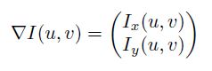

---
# Edge Detection
Leonhard Applis - 05.11.2018
+++
## Table of Contents
1. What makes an edge?
2. Basics of gradient-based edgedetection
3. Advanced gradient-based edgedetection
4. compass operators
5. (can be left) medical use

---
## What makes an edge?
+++

<h3> Problem I: similiar colours</h3>

     

+++?image=images/gradientchange.jpg
### Problem II: minor changes

+++

<h3> Problem III: Random Noise</h3>

     

+++
### Definition
@quote[In Image Processing, an edge can be defined as a set of contiguous pixel positions where an abrupt change of intensity, gray- or color-values occur. Edges represent boundaries between objects and background. Sometimes, the edge-pixel-sequence may be broken due to insufficient intensity difference.](Malay K. Pakhira )

---
## The basics of gradient-based edgedetection

+++
@transition[none]

@snap[east]

@snapend

@snap[north]
<h3> Image-requirements</h3>
@snapend

@snap[west]
Requirements:  
<ol>
<li>1. color values known </li>
<li>2. picture scale known </li>
<li>3. load as pixelmatrix </li>
</ol>
@snapend

+++

<h3>One dimensional approach</h3> 
    

         
    

    take one row of the matrix, and plot a function and a derivative

+++

    
 Problem: Image can only be seen as discrete Function (Pixel per Pixel) 

    
 Therefore: $$\dfrac{df}{dx}(u) \approx \dfrac{f(u+1) - f(u-1)}{(u+1)-(u-1)} = \dfrac{f(u+1) - f(u-1)}{2}$$ 
   

+++

    
If working with full images,we got two dimensions and therefore two partial derivations:  

    
$$I_x = \dfrac{\partial I}{\partial x}(u,v) , I_y = \dfrac{\partial I}{\partial y}(u,v)$$ 

    
the <b>gradient</b> at the point (u,v) is
        
    

    
 and the <b>magnitude</b>   $$|\nabla I|=\sqrt{I_x^2 + I_y^2}$$ 

+++

+++

    <h3> Applying a filter </h3>
    
Transfering the gradient to a linear filter is simple:

        

         
         
    

---
## Advanced gradient-based edgedetection

+++
### Using 3x3 filters
basic Idea how we can apply 3x3 filters to our picture

+++

<h3>Prewitt Operator</h3> 

     
    

+++

<h3>Sobel Operator</h3> 

 

+++

<h3>General Magnitude</h3>
    

        
    

    
holds for every Operator 

+++
### Calculating the direction
show arctang and what it does

show possible problems

---
## Compass Operators
Idea and Main Problems (Tradeoff Edge-Detection and Direction-Detection)

+++
### Extended Sobel Operator
Show the Extended Sobel operators and why we have 8 of them now, what we are doing with them and why its good.

+++
### Kirsch Operator
i guess just presenting it would be enough, if i explain a lot at the extended sobel

+++
### Canny-Edge Operator
why its the "best" and how it works with 2nd derivative

---
## Edge sharpening

+++
### Smoothing

---
## Medical use
Iff i still have time to fill or i find something very nice dudes

---
## Questions
also list primary sources here